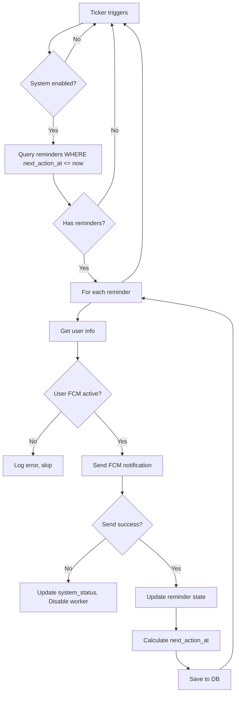

# Worker System Documentation - RemiAq

> **Mục đích**: Tài liệu này giúp Developer mới nhanh chóng hiểu và làm việc với Worker System của RemiAq.

---

## 📋 Mục lục

1. [Tổng quan hệ thống](#1-tổng-quan-hệ-thống)
2. [Kiến trúc Worker](#2-kiến-trúc-worker)
3. [Luồng hoạt động](#3-luồng-hoạt động)
4. [Các thành phần chính](#4-các-thành-phần-chính)
5. [Database Schema](#5-database-schema)
6. [Hướng dẫn phát triển](#6-hướng-dẫn-phát-triển)
7. [Testing & Debugging](#7-testing--debugging)
8. [Common Issues](#8-common-issues)

---

## 1. Tổng quan hệ thống

### 1.1. Worker là gì?

Worker là **background service** chạy liên tục để:
- ✅ Gửi thông báo nhắc việc (reminder) đúng thời điểm
- ✅ Retry thông minh khi user chưa hoàn thành
- ✅ Xử lý chu kỳ lặp phức tạp (daily, weekly, monthly, lunar)
- ✅ Quản lý trạng thái hệ thống và xử lý lỗi

### 1.2. Tại sao cần nhiều Workers?

```
┌─────────────────────────────────────────────────────────────┐
│                    WORKER SYSTEM                             │
├─────────────────────────────────────────────────────────────┤
│                                                               │
│  ┌──────────────────┐  ┌──────────────────┐  ┌────────────┐│
│  │ WorkerOneTimeV2  │  │ WorkerLoopNoUT   │  │WorkerLoopUT││
│  │                  │  │                  │  │            ││
│  │ Cases 1-3        │  │ Cases 4-5        │  │ Cases 6-7  ││
│  │ ONE-TIME         │  │ RECURRING        │  │ RECURRING  ││
│  │ reminders        │  │ No "until        │  │ With       ││
│  │                  │  │ complete"        │  │ "until     ││
│  │                  │  │                  │  │ complete"  ││
│  └──────────────────┘  └──────────────────┘  └────────────┘│
│                                                               │
└─────────────────────────────────────────────────────────────┘
```

**Lý do tách riêng:**
- 🎯 **Single Responsibility**: Mỗi worker chỉ xử lý 1 loại logic
- 🔧 **Dễ maintain**: Sửa 1 worker không ảnh hưởng workers khác
- 🚀 **Scalable**: Có thể scale từng worker độc lập
- 🧪 **Testable**: Dễ test từng worker riêng biệt

---

## 2. Kiến trúc Worker

### 2.1. Tech Stack

```
┌─────────────────────────────────────────────────┐
│ Language:     Golang (Goroutines)              │
│ Framework:    PocketBase (Backend)             │
│ Database:     SQLite (via PocketBase ORM)      │
│ Notification: Firebase FCM SDK                 │
│ Time Calc:    java.time port (ZonedDateTime)   │
│ Logging:      Custom Logger with tags          │
└─────────────────────────────────────────────────┘
```

### 2.2. Cấu trúc thư mục

```
internal/worker/
├── baseWorker.go              # Interfaces (UserRepo, SystemStatusRepo)
├── common.go                  # Shared functions (SendNotification, IsWorkerSystemEnabled)
├── reminder_orm_repo_worker.go # Database queries cho workers
├── worker_onetime_v2.go       # Worker xử lý ONE-TIME reminders
├── worker_loop_noUT.go        # Worker xử lý RECURRING (no until-complete)
└── worker_loop_UT.go          # Worker xử lý RECURRING (with until-complete)
```

### 2.3. Worker Lifecycle

```
main.go
   │
   ├──> Initialize FCMService
   ├──> Create WorkerRepo, UserRepo, SysRepo
   │
   ├──> NewWorkerOneTimeV2(...)
   ├──> NewWorkerLoopNoUT(...)
   ├──> NewWorkerLoopUT(...)
   │
   └──> worker.Start(context) ─┐
                                │
        ┌───────────────────────┘
        │
        ▼
   ┌────────────────────┐
   │  Ticker Loop       │
   │  (Every 5-60 sec)  │
   └────────────────────┘
        │
        ├──> Check system enabled?
        ├──> Query reminders due now
        ├──> Process each reminder
        │      ├──> Send FCM notification
        │      ├──> Update reminder state
        │      └──> Calculate next run time
        │
        └──> Repeat...
```

---

## 3. Luồng hoạt động

### 3.1. Flow Overview



### 3.2. Case Flow Matrix

| Case | Type | CRP | Strategy | First Send | Retry | Complete Required |
|------|------|-----|----------|-----------|-------|-------------------|
| 1 | ONE_TIME | No | - | ✓ Mark completed | - | - |
| 2 | ONE_TIME | Yes | - | ✓ Set next_crp | ✓ Until quota | Mark when quota reached |
| 3 | ONE_TIME | Yes | - | (Retry) | ✓ Increment crp_count | - |
| 4 | RECURRING | No | none | ✓ Calc next_recurring | - | - |
| 5.1 | RECURRING | Yes | none | ✓ FRP, Reset CRP | - | - |
| 5.2 | RECURRING | Yes | none | - | ✓ CRP retry | - |
| 6.1 | RECURRING | No | until_complete | ✓ Set is_sended_one_time | - | ✓ Wait user |
| 6.2 | RECURRING | No | until_complete | ✓ After user completed | - | ✓ Wait user |
| 7.1.1 | RECURRING | Yes | until_complete | ✓ FRP First, Start CRP | - | ✓ Wait user |
| 7.1.2 | RECURRING | Yes | until_complete | ✓ FRP After complete | - | ✓ Wait user |
| 7.2 | RECURRING | Yes | until_complete | - | ✓ CRP if not completed | - |

---

## 4. Các thành phần chính

### 4.1. Worker Structure Pattern

Tất cả workers đều follow pattern này:

```go
type WorkerXXX struct {
    repo       *WorkerReminderRepo      // Database operations
    userRepo   UserRepo                 // User info
    sysRepo    SystemStatusRepo         // System status
    interval   time.Duration            // Ticker interval
    logger     *utils.Logger            // Tagged logger
    fcmService *services.FCMService     // FCM notification
}

func NewWorkerXXX(...) *WorkerXXX {
    return &WorkerXXX{...}
}

func (w *WorkerXXX) Start(ctx context.Context) {
    ticker := time.NewTicker(w.interval)
    go func() {
        for {
            select {
            case <-ticker.C:
                w.runOnce(ctx)
            case <-ctx.Done():
                return
            }
        }
    }()
}

func (w *WorkerXXX) runOnce(ctx context.Context) {
    // 1. Check system enabled
    // 2. Query reminders
    // 3. Process each case
}
```

### 4.2. Shared Functions (common.go)

#### `IsWorkerSystemEnabled`
```go
func IsWorkerSystemEnabled(
    ctx context.Context, 
    sysRepo SystemStatusRepo, 
    logError func(format string, v ...any)
) bool
```
- Check `system_status.enabled` field
- Return false nếu system bị disable (admin tắt hoặc có lỗi nghiêm trọng)

#### `SendNotification`
```go
func SendNotification(
    ctx context.Context,
    reminder *models.Reminder,
    userRepo UserRepo,
    sysRepo SystemStatusRepo,
    logError func(format string, v ...any),
    fcmService *services.FCMService,
) error
```

**Flow:**
1. Get user by reminder.UserID
2. Check user.IsFCMActive && user.FCMToken != ""
3. Call `fcmService.SendNotification(token, title, description)`
4. **If error:**
   - Update `system_status.last_error`
   - Set `system_status.enabled = false`
   - Disable worker to prevent flood

**⚠️ QUAN TRỌNG:** Function này tự động disable worker khi có system error!

### 4.3. Repository Pattern

```go
// Query methods trong reminder_orm_repo_worker.go
func (r *WorkerReminderRepo) GetOneTimeNoCRP(ctx, now) ([]*models.Reminder, error)
func (r *WorkerReminderRepo) GetRecurringCRPTrigger(ctx, now) ([]*models.Reminder, error)
// ... các query methods khác

// Update method
func (r *WorkerReminderRepo) Update(ctx, reminder) error
```

**Pattern:**
- Mỗi case có 1 query method riêng
- Query WHERE điều kiện phức tạp (status, time, flags...)
- Return slice reminders hoặc error

---

## 5. Database Schema

### 5.1. Reminders Table Core Fields

```sql
CREATE TABLE reminders (
    -- Identity
    id TEXT PRIMARY KEY,
    user_id TEXT NOT NULL,
    
    -- Content
    title TEXT NOT NULL,
    description TEXT,
    
    -- Type & Strategy
    type TEXT CHECK(type IN ('one_time', 'recurring')),
    repeat_strategy TEXT CHECK(repeat_strategy IN ('none', 'crp_until_complete')),
    calendar_type TEXT CHECK(calendar_type IN ('solar', 'lunar')),
    
    -- Timing
    next_action_at TIMESTAMP,      -- Thời điểm chạy tiếp theo (main trigger)
    next_recurring TIMESTAMP,      -- FRP cycle time (cho recurring)
    next_crp TIMESTAMP,            -- CRP retry time
    origin_time TIMESTAMP,         -- Thời gian gốc (để tính lunar)
    
    -- CRP Configuration
    max_crp INTEGER DEFAULT 0,     -- Số lần retry tối đa
    crp_count INTEGER DEFAULT 0,   -- Đã retry bao nhiêu lần
    crp_interval_sec INTEGER,      -- Khoảng cách giữa các retry
    
    -- State Tracking
    status TEXT CHECK(status IN ('active', 'paused', 'completed')),
    is_sended_one_time BOOLEAN DEFAULT FALSE,  -- Đã gửi lần đầu chưa
    last_sent_at TIMESTAMP,         -- Lần gửi notification cuối
    last_completed_at TIMESTAMP,    -- Lần user complete cuối
    snooze_until TIMESTAMP,         -- Tạm hoãn đến khi nào
    
    -- Recurrence Pattern (JSON)
    recurrence_pattern TEXT,        -- JSON polymorphic object
    
    -- Metadata
    created TIMESTAMP,
    updated TIMESTAMP
);
```

### 5.2. Key Fields Explained

| Field | Purpose | Updated By |
|-------|---------|------------|
| `next_action_at` | **Master trigger** - Worker query WHERE this <= now() | Worker (mỗi lần process) |
| `next_recurring` | FRP cycle time (recurring only) | Worker (Cases 4,5) / API Complete (Cases 6,7) |
| `next_crp` | CRP retry time | Worker (khi có CRP) |
| `is_sended_one_time` | Flag lần đầu gửi (Cases 6,7) | Worker (set true 1 lần, không bao giờ reset) |
| `last_sent_at` | Tracking lần gửi cuối | Worker (mỗi lần send success) |
| `last_completed_at` | Tracking complete cuối | API Complete endpoint |
| `crp_count` | Counter retry hiện tại | Worker (increment mỗi CRP) |

### 5.3. RecurrencePattern JSON Structure

```typescript
// Type: daily
{
  "type": "daily",
  "interval": 1,        // Every N days
  "time_of_day": "08:00"
}

// Type: weekly
{
  "type": "weekly",
  "interval": 1,        // Every N weeks
  "days_of_week": [1, 3, 5],  // Monday, Wednesday, Friday
  "time_of_day": "09:00"
}

// Type: monthly (solar)
{
  "type": "monthly",
  "interval": 1,
  "day_of_month": 15,   // Ngày 15 hàng tháng
  "time_of_day": "10:00"
}

// Type: interval_seconds
{
  "type": "interval_seconds",
  "interval_seconds": 3600  // Every 1 hour
}
```

---

## 6. Hướng dẫn phát triển

### 6.1. Onboarding Checklist

**Ngày 1-2: Setup & Understand**
- [ ] Clone repo, setup local database
- [ ] Đọc `v2docs/worker_v2_flow.md` (Chi tiết 7 cases)
- [ ] Chạy server local, xem log workers
- [ ] Tạo test reminder, quan sát flow

**Ngày 3-4: Deep Dive Code**
- [ ] Đọc `common.go` - hiểu shared functions
- [ ] Đọc 1 worker file (bắt đầu từ `worker_onetime_v2.go`)
- [ ] Trace 1 case cụ thể từ query → process → update
- [ ] Hiểu cách logger hoạt động

**Ngày 5+: Start Contributing**
- [ ] Fix 1 bug nhỏ hoặc refactor
- [ ] Thêm test case
- [ ] Viết tài liệu cho feature mới

### 6.2. Thêm Worker Case Mới

**Bước 1: Xác định requirement**
```
- Type: one_time hay recurring?
- CRP: Có retry không?
- Strategy: none hay until_complete?
- Timing: Điều kiện trigger là gì?
```

**Bước 2: Thêm query method**
```go
// File: reminder_orm_repo_worker.go
func (r *WorkerReminderRepo) GetYourNewCase(ctx context.Context, now time.Time) ([]*models.Reminder, error) {
    return r.fetchReminders(ctx, dbx.HashExp{
        "type": models.ReminderTypeXXX,
        "status": models.ReminderStatusActive,
        // ... điều kiện khác
    }, now, "next_action_at", 
        dbx.NewExp("your_condition = true"))
}
```

**Bước 3: Thêm process method trong worker**
```go
func (w *WorkerXXX) processYourNewCase(ctx context.Context, now time.Time) error {
    logCase := w.logger.WithTag("CaseX_YourCase")
    
    reminders, err := w.repo.GetYourNewCase(ctx, now)
    if err != nil {
        return err
    }
    
    if len(reminders) == 0 {
        return nil
    }
    
    logCase.Infof("Found %d reminders", len(reminders))
    
    for _, r := range reminders {
        // Send notification
        if err := SendNotification(ctx, r, w.userRepo, w.sysRepo, w.logger.Errorf, w.fcmService); err != nil {
            logCase.Errorf("Send failed ID=%s: %v", r.ID, err)
            continue
        }
        
        // Update reminder state
        r.LastSentAt = now
        // ... cập nhật logic của bạn
        
        if err := w.repo.Update(ctx, r); err != nil {
            logCase.Errorf("Update failed ID=%s: %v", r.ID, err)
        }
    }
    return nil
}
```

**Bước 4: Gọi trong runOnce**
```go
func (w *WorkerXXX) runOnce(ctx context.Context) {
    if !IsWorkerSystemEnabled(ctx, w.sysRepo, w.logger.Errorf) {
        return
    }
    now := time.Now().UTC()
    
    // ... existing cases
    
    if err := w.processYourNewCase(ctx, now); err != nil {
        w.logger.Errorf("Error processing YourCase: %v", err)
    }
}
```

### 6.3. Best Practices

#### DO ✅
```go
// 1. Luôn check system enabled đầu tiên
if !IsWorkerSystemEnabled(ctx, w.sysRepo, w.logger.Errorf) {
    return
}

// 2. Sử dụng logger với tag
logCase := w.logger.WithTag("Case4_RecurringNoCRP")
logCase.Infof("Processing %d reminders", len(reminders))

// 3. Handle error gracefully - continue với reminder tiếp theo
if err := SendNotification(...); err != nil {
    logCase.Errorf("Send failed ID=%s: %v", r.ID, err)
    continue  // Không return ngay, xử lý tiếp reminder khác
}

// 4. Luôn update last_sent_at khi gửi success
r.LastSentAt = now
```

#### DON'T ❌
```go
// 1. Đừng hard-code time
// BAD
r.NextCRP = now.Add(5 * time.Minute)

// GOOD
r.NextCRP = now.Add(time.Duration(r.CRPIntervalSec) * time.Second)

// 2. Đừng panic trong worker
// BAD
if err != nil {
    panic(err)
}

// GOOD
if err != nil {
    w.logger.Errorf("Error: %v", err)
    return err
}

// 3. Đừng block goroutine quá lâu
// BAD
for _, r := range reminders {
    time.Sleep(5 * time.Second) // Blocking!
}

// GOOD
// Process nhanh, release goroutine cho cycle tiếp theo
```

### 6.4. Debugging Tips

#### Xem log workers
```bash
# Chạy server với log đầy đủ
go run cmd/server/main.go serve

# Filter log theo worker
# Log format: [WORKER_ONE_TIME_V2] hoặc [##4---RecurringNoCRP]
```

#### Check database state
```sql
-- Xem reminders sắp chạy
SELECT id, title, type, next_action_at, status 
FROM reminders 
WHERE status = 'active' 
  AND next_action_at <= datetime('now')
ORDER BY next_action_at;

-- Check reminder cụ thể
SELECT * FROM reminders WHERE id = 'your_reminder_id';

-- Check system status
SELECT * FROM system_status LIMIT 1;
```

#### Force trigger reminder
```sql
-- Set next_action_at về quá khứ để trigger ngay
UPDATE reminders 
SET next_action_at = datetime('now', '-1 minute')
WHERE id = 'your_reminder_id';
```

---

## 7. Testing & Debugging

### 7.1. Manual Testing Flow

**Test Case 1: ONE-TIME No CRP**
```sql
INSERT INTO reminders (
    id, user_id, title, description,
    type, status, max_crp,
    next_action_at, is_sended_one_time
) VALUES (
    'test-onetime-nocrp',
    'your_user_id',
    'Test ONE-TIME',
    'Should send and complete',
    'one_time',
    'active',
    0,
    datetime('now', '+1 minute'),
    false
);
```

**Expected:**
1. Worker picks up sau 1 phút
2. Gửi FCM notification
3. Set `status = 'completed'`
4. Set `is_sended_one_time = true`

**Test Case 2: RECURRING Daily**
```sql
INSERT INTO reminders (
    id, user_id, title, type, status,
    max_crp, repeat_strategy,
    next_recurring, next_action_at,
    recurrence_pattern, calendar_type
) VALUES (
    'test-recurring-daily',
    'your_user_id',
    'Daily Reminder',
    'recurring',
    'active',
    0,
    'none',
    datetime('now', '+1 minute'),
    datetime('now', '+1 minute'),
    '{"type":"daily","interval":1,"time_of_day":"08:00"}',
    'solar'
);
```

**Expected:**
1. Gửi notification sau 1 phút
2. Calculate `next_recurring` = tomorrow 8:00 AM
3. Update `next_action_at` = `next_recurring`
4. Không đổi status (vẫn active để lặp lại)

### 7.2. Unit Test Pattern (Future)

```go
// TODO: Thêm unit tests
func TestWorkerOneTimeV2_ProcessNoCRP(t *testing.T) {
    // Setup
    mockRepo := &MockWorkerRepo{}
    mockUserRepo := &MockUserRepo{}
    mockSysRepo := &MockSystemStatusRepo{}
    
    worker := NewWorkerOneTimeV2(
        app, mockSysRepo, mockRepo, mockUserRepo, 
        time.Minute, mockFCMService,
    )
    
    // Test data
    reminder := &models.Reminder{
        ID: "test-1",
        Type: models.ReminderTypeOneTime,
        MaxCRP: 0,
        // ...
    }
    
    mockRepo.On("GetOneTimeNoCRP").Return([]*models.Reminder{reminder}, nil)
    mockUserRepo.On("GetByID").Return(&models.User{FCMToken: "token"}, nil)
    
    // Execute
    err := worker.processNoCRP(context.Background(), time.Now())
    
    // Assert
    assert.NoError(t, err)
    assert.Equal(t, models.ReminderStatusCompleted, reminder.Status)
    mockRepo.AssertCalled(t, "Update", reminder)
}
```

---

## 8. Common Issues

### 8.1. Worker không chạy

**Triệu chứng:** Log không thấy worker activity

**Debug:**
```sql
-- Check system_status
SELECT enabled, last_error FROM system_status LIMIT 1;
```

**Giải pháp:**
- Nếu `enabled = false`, set lại `UPDATE system_status SET enabled = true`
- Check `last_error` để biết lý do disable

### 8.2. Notification không gửi được

**Triệu chứng:** Worker chạy nhưng không thấy notification trên device

**Debug checklist:**
- [ ] Check user có `is_fcm_active = true`?
- [ ] Check `fcm_token` có valid không?
- [ ] Check Firebase credentials file tồn tại?
- [ ] Check log có error "FCM send failed"?

**Giải pháp:**
```go
// Trong SendNotification, log chi tiết:
w.logger.Infof("Sending to token: %s, title: %s", user.FCMToken, reminder.Title)
```

### 8.3. Reminder lặp quá nhiều lần

**Triệu chứng:** Cùng 1 reminder gửi liên tục mỗi 5 giây

**Nguyên nhân:**
- `next_action_at` không được update sau khi gửi
- Logic calculate next time sai

**Giải pháp:**
```go
// Đảm bảo luôn update next_action_at
r.NextActionAt = calculateNextActionAt(r, now)
if err := w.repo.Update(ctx, r); err != nil {
    // MUST handle this error!
}
```

### 8.4. Worker bị crash

**Triệu chứng:** Server restart liên tục, panic log

**Nguyên nhân thường gặp:**
- Nil pointer (fcmService, repo, logger)
- Database connection lost
- Infinite loop trong calculate logic

**Giải pháp:**
```go
// Luôn check nil trước khi dereference
if w == nil || w.fcmService == nil {
    return
}

// Catch panic trong goroutine
defer func() {
    if r := recover(); r != nil {
        w.logger.Errorf("Worker panic recovered: %v", r)
    }
}()
```

---

## 9. Roadmap & TODOs

### 9.1. Current Limitations

- ⚠️ **No retry mechanism**: Nếu DB query fail, skip luôn cycle đó
- ⚠️ **No distributed lock**: Không chạy multiple instances được
- ⚠️ **No metrics/monitoring**: Khó track performance
- ⚠️ **No graceful shutdown**: Context cancel nhưng chưa đợi process xong

### 9.2. Future Improvements

**Phase 1: Stability**
- [ ] Add unit tests cho mỗi worker
- [ ] Add integration tests
- [ ] Implement graceful shutdown
- [ ] Add health check endpoint

**Phase 2: Observability**
- [ ] Add Prometheus metrics (reminders_processed, notifications_sent)
- [ ] Add distributed tracing (OpenTelemetry)
- [ ] Dashboard cho admin monitor workers

**Phase 3: Scalability**
- [ ] Implement distributed lock (Redis)
- [ ] Support horizontal scaling
- [ ] Queue-based architecture (RabbitMQ/Redis Queue)

---

## 10. FAQs

**Q: Tại sao không dùng Cron Jobs?**
A: Cron không linh hoạt cho dynamic schedules (user tự set time). Worker có thể query DB và xử lý real-time.

**Q: next_action_at vs next_recurring khác nhau thế nào?**
A: 
- `next_action_at`: Master trigger, worker query theo field này
- `next_recurring`: Chỉ cho recurring, là FRP cycle time
- Với CRP: `next_action_at = min(next_recurring, next_crp)`

**Q: Khi nào dùng `repeat_strategy = crp_until_complete`?**
A: Khi cần chờ user complete task trước khi gửi cycle tiếp theo (VD: uống thuốc, phải uống xong mới nhắc lại ngày mai).

**Q: is_sended_one_time có reset về false không?**
A: **KHÔNG BAO GIỜ**. Nó chỉ set true 1 lần để phân biệt lần đầu vs lần sau.

---

## 11. Contacts & Resources

**Tài liệu liên quan:**
- `v2docs/worker_v2_flow.md` - Chi tiết 7 cases
- `v2docs/architecture.md` - Overall system architecture
- Firebase FCM Docs: https://firebase.google.com/docs/cloud-messaging

**Code Reference:**
- `internal/services/calNextTime.go` - Time calculation logic
- `internal/models/reminder.go` - Reminder model & validation

**Team:**
- Backend Lead: [Tên]
- Worker Maintainer: [Tên]
- On-call: [Tên + Contact]

---

## 12. Changelog

| Version | Date | Changes | Author |
|---------|------|---------|--------|
| 2.0 | 2025-12-03 | Refactor to FCMService, consolidate SendNotification | [Tên] |
| 1.5 | 2025-12-03 | Add WorkerLoopUT (Cases 6-7) | [Tên] |
| 1.0 | 2025-11-XX | Initial worker system | [Tên] |

---

**📝 Note cho Developer mới:**

1. **Đừng sợ hỏi**: Worker logic phức tạp, cần thời gian để hiểu hết
2. **Chạy local trước**: Test trên local DB trước khi deploy production
3. **Đọc log thường xuyên**: Logger là bạn tốt nhất khi debug
4. **Modify cẩn thận**: Worker ảnh hưởng trực tiếp đến user experience
5. **Document changes**: Update tài liệu này khi thêm feature mới

**Happy Coding! 🚀**
